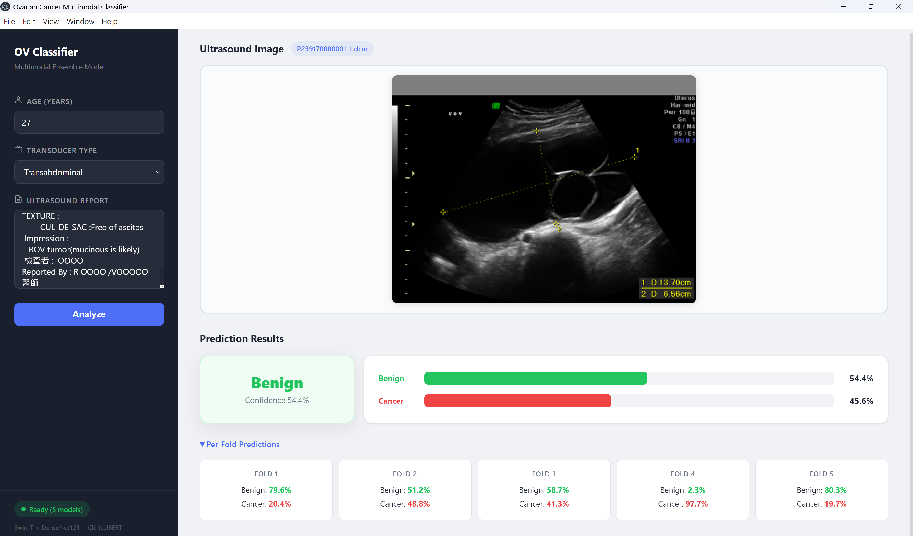

# Ovarian Cancer Multimodal Classifier

Implementation of the paper: **"Development of A Novel Multimodal Deep Learning Approach to Improve Diagnostic Precision in Ovarian Cancer"** .

A multimodal deep learning system for classifying ovarian masses as **Benign** or **Malignant** using ultrasound images and clinical data. The model fuses visual features from **Swin Transformer** and **DenseNet-121** with clinical text embeddings from **Bio-Clinical BERT** through a concatenation-based late-fusion architecture.

## GUI Application



The desktop application provides an intuitive interface with:

- **Sidebar** — Enter clinical data including patient age, transducer type, and ultrasound report
- **Main area** — Upload and preview ultrasound images (DICOM, PNG, JPG), then view ensemble prediction results with per-fold details
- **DICOM rendering** — DICOM files are automatically converted and displayed as image previews
- **Ensemble prediction** — Results are aggregated from 5 cross-validation fold models using soft voting

## Model Architecture

```
                    ┌────────────────────────┐
  Ultrasound Image ─┤  Swin-T → 768-d        ├──┐
                    │  dropout(0.5) + BN      │  │
                    └────────────────────────┘  │
                    ┌────────────────────────┐  │  ┌──────────────────────┐  ┌────────────┐
  Ultrasound Image ─┤  DenseNet-121 → 1024-d ├──┼─►│ Fusion MLP           ├─►│ Classifier │
                    │  dropout(0.5) + BN      │  │  │ 1920→512→256→logits  │  │ (2 classes)│
                    └────────────────────────┘  │  └──────────────────────┘  └────────────┘
                    ┌────────────────────────┐  │
  Clinical Text    ─┤  Bio-Clinical BERT     ├──┘
                    │  MLP: →512→256→128-d   │
                    └────────────────────────┘
```

**Input modalities:**
- **Ultrasound image** (DICOM format) — processed through automatic ROI detection, aspect-ratio-preserving resize to 224×224, and ImageNet normalization
- **Clinical data** — patient age (standardized), transducer type (one-hot encoded), and free-text ultrasound report encoded via Bio-Clinical BERT [CLS] token

**Feature dimensions:**
- DenseNet-121: 1024-d → dropout (p=0.5) + batch normalization
- Swin Transformer: 768-d → dropout (p=0.5) + batch normalization
- Bio-Clinical BERT → MLP (BERT output → 512 → 256 → **128-d**); uses LayerNorm + GELU activation
- Fusion MLP: concatenated 1920-d → 512 (ReLU, dropout 0.5) → 256 (ReLU, dropout 0.3) → 2 classes

**Training strategy:**
- 5-fold stratified cross-validation with subject-level splitting (no data leakage)
- Weighted random sampling for class imbalance
- Ultrasound-specific augmentation: speckle noise, acoustic shadowing, posterior acoustic enhancement, plus geometric transforms (random scaling ×0.95–1.05, rotation ±15°)
- Focal Loss with AdamW optimizer (lr=5e-5, weight decay=1e-4), max 150 epochs, early stopping (patience=30)

## Dataset

The model was developed and validated on a retrospective cohort from the National Taiwan University Hospital (NTUH) system (Main Hospital and Hsinchu Branch), covering January 2011 to December 2021.

| | Count |
|---|---|
| **Patients** | 1,062 |
| **Ultrasound images** | 1,342 |
| **Benign** | 612 patients (57.63%) |
| **Malignant / Borderline** | 450 patients (42.37%) |
| **Average patient age** | 43.26 years |

Representative DICOM images were selected by two senior gynecologists. The dataset was split using subject-level stratification (15% held-out test set + 5-fold cross-validation) to prevent data leakage from patients with multiple images sharing a single text report.

## Project Structure

```
OV/
├── src/                          # Modular Python package
│   ├── config.py                 # Hyperparameters and constants
│   ├── data/
│   │   ├── dicom_utils.py        # DICOM file reading
│   │   ├── transforms.py         # Image augmentation transforms
│   │   ├── text_processor.py     # BertTextProcessor (clinical features)
│   │   └── dataset.py            # PyTorch Dataset classes
│   ├── models/
│   │   ├── multimodal_model.py   # MultimodalModel architecture
│   │   └── losses.py             # FocalLoss, multi-task loss, CutMix
│   ├── training/
│   │   ├── trainer.py            # Main training loop
│   │   ├── evaluation.py         # Evaluation and ensemble prediction
│   │   └── utils.py              # Metrics, checkpointing, data splitting
│   └── inference.py              # Inference pipeline for deployment
├── gui/                          # Electron desktop application
│   ├── main.js                   # Electron main process
│   ├── preload.js                # Context bridge (IPC file access)
│   ├── index.html                # Sidebar layout UI
│   ├── style.css                 # Dark sidebar + light main area styling
│   ├── renderer.js               # Frontend logic and DICOM preview
│   └── package.json              # Node.js dependencies
├── server.py                     # FastAPI inference server (predict + DICOM preview)
├── train.py                      # Training entry point
├── main.py                       # Original monolithic script (reference)
├── Clinical_data.csv             # Clinical metadata
├── UltrasoundImage/              # DICOM image data (not included in repo)
│   ├── Bengin/                   # Benign cases
│   └── Cancer/                   # Cancer cases
├── log/                          # Trained model checkpoints
│   ├── best_model_fold1.pth
│   ├── best_model_fold2.pth
│   ├── best_model_fold3.pth
│   ├── best_model_fold4.pth
│   └── best_model_fold5.pth
├── pyproject.toml                # Python dependencies
└── README.md
```

## Requirements

- **Python** >= 3.10
- **Node.js** >= 18 (for the GUI)
- **CUDA** compatible GPU (recommended for training; CPU supported for inference)

## Installation

### 1. Python Environment

```bash
# Clone the repository
git clone https://github.com/<your-username>/OV.git
cd OV

# Create and activate virtual environment (using uv)
uv sync

# Or using pip
python -m venv .venv
# Windows
.venv\Scripts\activate
# Linux/macOS
source .venv/bin/activate
pip install -r requirements.txt
```

### 2. GUI (Electron)

```bash
cd gui
npm install
```

## Usage

### Training

Run the full 5-fold cross-validation training pipeline:

```bash
python train.py
```

This will:
1. Load clinical data and fit the Bio_ClinicalBERT text processor
2. Build the multimodal dataset from DICOM images and metadata
3. Perform subject-level train/val/test splitting
4. Train 5 folds with early stopping (patience=30, max 150 epochs)
5. Evaluate with ensemble prediction on the held-out test set
6. Save results to `log/multimodal_ov/`

### GUI Application

Launch the desktop application:

```bash
cd gui
npm start
```

The application will:
1. Automatically start the FastAPI inference server in the background
2. Load all 5 fold models for ensemble prediction
3. Display a sidebar-based interface where you can:
   - Upload an ultrasound image (DICOM, PNG, or JPG) with real-time preview
   - Enter clinical data (age, transducer type, ultrasound report)
   - Click **Analyze** to run ensemble prediction
   - View the classification result (Benign/Cancer) with confidence score, probability bars, and per-fold breakdown

### Inference Server Only

Run the FastAPI server standalone (without the GUI):

```bash
python server.py
```

The API is available at `http://127.0.0.1:8000`. Endpoints:

| Method | Endpoint    | Description                              |
|--------|-------------|------------------------------------------|
| GET    | `/health`   | Health check and model status             |
| POST   | `/predict`  | Run ensemble prediction                   |
| POST   | `/preview`  | Convert uploaded image to base64 PNG preview |

Example prediction request:

```bash
curl -X POST http://127.0.0.1:8000/predict \
  -F "image=@ultrasound.dcm" \
  -F "age=45.0" \
  -F "transducer_type=Trandabdominal" \
  -F "report_text=SONAR FINDING: ..."
```

## Data Format

### Clinical Data CSV

The `Clinical_data.csv` file must contain the following columns:

| Column           | Description                                   |
|------------------|-----------------------------------------------|
| `ID`             | Image identifier matching DICOM filename      |
| `UltrasoundRoute`| Transducer type (`Trandabdominal` / `Transvaginal`) |
| `AGE`            | Patient age in years                          |
| `REPORT_TEXT`    | Free-text ultrasound report                   |
| `Class`          | Ground-truth label (`Benign`, `Malignant`, etc.) |

### Image Data

DICOM files should be organized under `UltrasoundImage/` in class subdirectories:

```
UltrasoundImage/
├── Bengin/          # Benign cases (DICOM files)
│   ├── P239170000001_1.dcm
│   └── ...
└── Cancer/          # Cancer cases (DICOM files)
    ├── P239170000002_1.dcm
    └── ...
```


**Ethics:** Approved by the NTUH Research Ethics Committee (202405140RINE).

**Funding:** Ministry of Science and Technology (MOST-106-2314-B-002-134-MY2, MOST-108-2314-B-002-103-MY2, MOST-109-2314-B-002-151-MY3), National Science Technology Council (NSTC-114-2314-B-002-067-MY3), and the Higher Education Sprout Project, Ministry of Education, Taiwan (NTU-114L9004).
